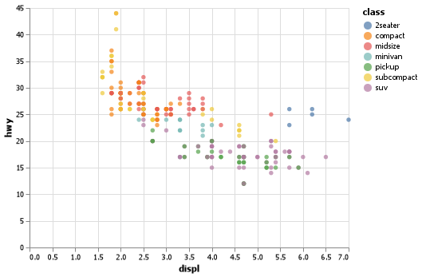

# Introduction
Author: Daniel Martinez

## Elevator Pitch
Install Visual Studio Code(VS) installing programming language Python 3.8.4 and VS extensions such Python, Markdown, and Jupyper.

Setup the environment installing libraries such Pandas, NumPy, Altair, Altair_saver.

Run Python code in VS for visualization the data in chart and download the data frame, to do a data exploration of the data frame with ```mpg.head()```. 

### Grand Question 1
Finish the readings and come to class prepared with any questions to get your environment working smoothly.

My environment is working smoothly, I have some errors one of them is to print a table with the attribute to_markdown() gave me ImportError to missing package tabulate I run  ```pip install tabulate```  and restarting VS and the table printed correctly.

Note: Altair_saver is not compatible with Python 3.9

### Grand Question 2
Create a python script and use VS Code to create the example Altair chart in the assigned readings (note that you have to type chart to see the Altair chart after you run the code). Save your Altair chart for submission.
```python
chart_color = (alt.Chart(mpg)#mpg dataframe called. 
  .encode(#encoder attribute
    x='displ', #variable for x value 
    y='hwy', # variable for y value 
    color ="class"
    )
  .mark_circle()#mark_circle attribute to create circle chart.
)
chart_color
# %% 
chart_color.save("screenshot/altair_color.png")
#call the variable to print the chart.
```



## Appendix Python Code
```python
# %%
#import packages
import sys
import pandas as pd
import altair as alt
import numpy as np
#import tables
#import tabulate as tab
# %%
alt.data_transformers.enable('json')

# %%
#extract dataframe
url = "https://github.com/byuidatascience/data4python4ds/raw/master/data-raw/mpg/mpg.csv"
mpg = pd.read_csv(url)
# %%
#
mpg.head()
# %%
#shape the dataframe
mpg.shape
# %%
chart_color = (alt.Chart(mpg)#mpg dataframe called. 
  .encode(#encoder attribute
    x='displ', #variable for x value 
    y='hwy', # variable for y value 
    color ="class" 
    )
  .mark_circle()#mark_circle attribute to create circle chart.
)
chart_color
# %% 
chart_color.save("screenshot/altair_color.png")
#call the variable with save() attribute in the filea assignated.

# %%
#plot a chart
chart = (alt.Chart(mpg)
  .encode(
    x='displ', 
    y='hwy'
    )
  .mark_circle()
)
chart #call the variable of chart

# %%
#run other type of chart for experimentation.
chart1 = (alt.Chart(mpg)
  .encode(#encoder attribute
    x='displ', 
    y='hwy',
    opacity ="class"
    )
  .mark_point()
)

chart1
# %%
chart1.save("screenshot/altair_opacity.png")
# %%
chart2 = (alt.Chart(mpg)
  .encode(
    x = "displ",
    y = "hwy",
    shape = "class"
    )
  .mark_point())
chart2
# %%

chart2.save("screenshot/altair_shape.png")
# %%
chart3 = (alt.Chart(mpg)
  .encode(
    x = "displ",
    y = "hwy",
    size = "class"
    )
  .mark_circle())
chart3
# %%
chart3.save("screenshot/altair_viz_3.png")
# %%
# First
chart1 = (alt.Chart(mpg)
  .encode(
    x = "displ",
    y = "hwy",
    opacity = "class"
    )
  .mark_circle())
chart1
# Second
chart2 = (alt.Chart(mpg)
  .encode(
    x = "displ",
    y = "hwy",
    shape = "class"
    )
  .mark_point())
chart2

  
# %%
  
chart1.save("screenshot/altair_opacity.png")
#> WARN Channel opacity should not be used with an unsorted discrete field.
chart2.save("screenshot/altair_shape.png")
# %%

chart = (alt.Chart(mpg)
  .encode(
    x = "displ",
    y = "hwy",
    color = alt.value("blue")
    )
  .mark_circle())

chart.save("screenshot/altair_viz_4.png")
# %%
chart_f = (alt.Chart(mpg)
  .encode(
    x = "displ",
    y = "hwy",
   )
  .mark_circle()
  .facet(
    facet = "class",
    columns = 4
  ))
  
chart_f.save("screenshot/altair_facet_1.png")
# %%
chart_f2 = (alt.Chart(mpg)
  .encode(
    x = "displ",
    y = "hwy",
    )
  .mark_circle()
  .facet(
    column = "drv",
    row = "cyl"
    ))
  
chart_f2.save("screenshot/altair_facet_2.png")
#> WARN row encoding should be discrete (ordinal / nominal / binned).
# %%
chartp = (alt.Chart(mpg)
  .encode(
    x = "displ",
    y = "hwy"
    )
  .mark_circle())

chartf = (alt.Chart(mpg)
  .encode(
    x = "displ",
    y = "hwy"
    )
  .transform_loess("displ", "hwy")
  .mark_line()
  )

chartp.save("screenshot/altair_basic_points.png")  
chartf.save("screenshot/altair_smooth_line.png")
# %%
base = (alt.Chart(mpg)
  .encode(
    x = "displ",
    y = "hwy"
    ))

chart = base.mark_circle() + base.transform_loess("displ", "hwy").mark_line()

chart.save("screenshot/altair_combine_clean.png")
  

# %%
base =(alt.Chart(mpg)
  .encode(
    x = "displ",
    y = "hwy"
  ))

chart = base.encode(color = "drv").mark_circle() + base.transform_loess("displ", "hwy").mark_line()

chart.save("screenshot/altair_combine_clean_color.png")
# %%
#column name of class does not work nicely with Altair filter.

base = (alt.Chart(mpg.rename(columns = {"class": "class1"}))
  .encode(
    x = "displ",
    y = "hwy"
    ))

chart_smooth_sub = (base
  .transform_filter(alt.datum.class1 == "subcompact")
  .transform_loess("displ", "hwy")
  .mark_line()
)  

chart = base.encode(color = "class1").mark_circle() + chart_smooth_sub

chart.save("screenshot/altair_combine_clean_color_filter.png")
# %%
#print a table 
table = mpg.head(5)
print(table.to_markdown())
#.to_markdown()


