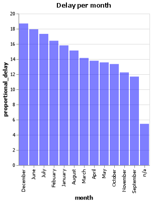

# ---Introduction---
Author: Daniel Martinez

## Elevator Pitch
Project 2 is focus in manage data in JSON file and be able to find any missing value and process the data to be able to respond the grant questions. 

Feature engineering 

## Grand Question 1
Which airport has the worst delays? How did you choose to define “worst”? As part of your answer include a table that lists the total number of flights, total number of delayed flights, proportion of delayed flights, and average delay time in hours, for each airport.

|    | airport_name                                          |   num_of_flights_total |   num_of_delays_total |   minutes_delayed_total |   proportional_delay |
|---:|:------------------------------------------------------|-----------------------:|----------------------:|------------------------:|---------------------:|
|  0 | Atlanta, GA: Hartsfield-Jackson Atlanta International |                4235114 |                870910 |                  868583 |              25.6625 |
|  1 | Chicago, IL: Chicago O'Hare International             |                3400032 |                773122 |                  869419 |              28.1715 |
|  2 | Denver, CO: Denver International                      |                2323376 |                439964 |                  394341 |              23.0262 |
|  3 | Salt Lake City, UT: Salt Lake City International      |                1293072 |                190733 |                  157682 |              17.7515 |
|  4 | San Diego, CA: San Diego International                |                 870161 |                167747 |                  132041 |              23.9663 |
|  5 | San Francisco, CA: San Francisco International        |                1565257 |                408631 |                  424811 |              33.1083 |
|  6 | Washington Dulles, International Airoport             |                 884879 |                172413 |                  176866 |              10.3494 |
|  7 | Washington, DC: Washington Dulles International       |                 773480 |                152630 |                  155375 |              23.5282 |

## Grand Question 2
What is the worst month to fly if you want to avoid delays? Include one chart to help support your answer, with the x-axis ordered by month. You also need to explain and justify how you chose to handle the missing Month data.

In base of the data the worst month to fly if you want to avoid delays, is December, June and July that result is in base of the summer brake and the hollydays of December the best months for travel without delay are September, November and Octuber, in relation with the n/a data I did not remove or modify due to is not representative and that can considerete a data bias. 

## Grand Question 3
According to the BTS website the Weather category only accounts for severe weather delays. Other “mild” weather delays are included as part of the NAS category and the Late-Arriving Aircraft category. Calculate the total number of flights delayed by weather (either severe or mild) using these two rules:

30% of all delayed flights in the Late-Arriving category are due to weather.

From April to August, 40% of delayed flights in the NAS category are due to weather. The rest of the months, the proportion rises to 65%.

## Grand Question 4
Create a barplot showing the proportion of all flights that are delayed by weather at each airport. What do you learn from this graph (Careful to handle the missing Late Aircraft data correctly)

## Grand Question 5
Fix all of the varied NA types in the data to be consistent and save the file back out in the same format that was provided (this file shouldn’t have the missing values replaced with a value). Include one record example from your exported JSON file that has a missing value (No imputation in this file).
