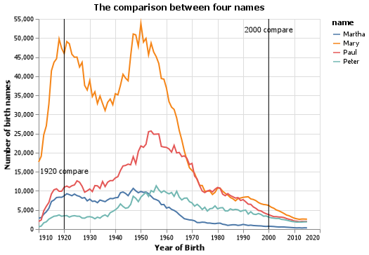
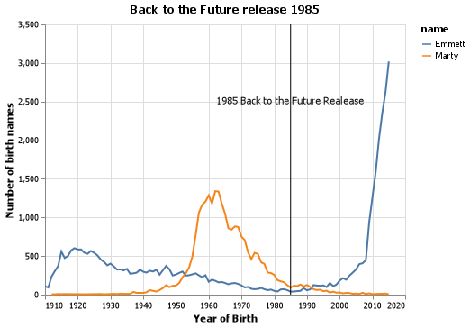
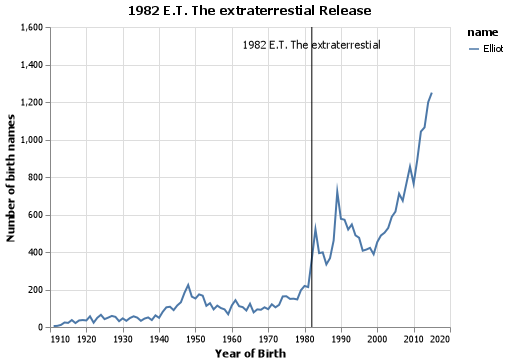

# ---Introduction---
Author: Daniel Martinez

## Elevator Pitch
Project number 1 names, this project can help us to apply preprocessing of data and visualization to take information back from a dataset. 

In this project, we use Pandas methods such as query(), filter(), groupby() to manipulate the data frame and answer the great questions. 

This project's goal is to implement visualization and apply that technique in a data frame.

## Grand Question 1
How does your name at your birth year compare to its use historically?
In 1984 the name of Daniel has used a total of 23345 times, Daniel is a biblical name that was used in 1910 for 658 times, during the 1940' and 1950' increase considerably the user of the name Daniel example of that is 1956 with a total of use of 25,242 times, between 1960 to 1980 the use of the name Daniel decrease lest of 20,000, between 1980 to 1997 the name of Daniel increase up 20,000, since 1997 the use of the name Daniel decrease bellow 20,000 times until the year 2020.
 
See visualization for more details:


## Grand Question 2
If you talked to someone named Brittany on the phone, what is your guess of their age? What ages would you not guess?
In the base of the data, the highest frequency of use the name Brittany is 1990 with 32,562 times used, for that reason I guess the range of age of Brittany is between 24 to 36 years old, I guess she has 30 years old.
I did not guess any age higher of 37 years old or lower of 20 years old due to in relation of the data between 1984 to 2000 this name was used frequently during this period of 16 years and declining of use in 2000 to lower of 5,000 times of use.


## Grand Question 3
Mary, Martha, Peter, and Paul are all Christian names. From 1920 - 2000, compare the name usage of each of the four names.
The name Mary was the most popular in the comparison with Martha, Peter, and Paul, since 1920 the use of the name Mary decrease considerably. during the period between 1940 - 1960 during the baby boom, the name of Mary, Paul, and Peter have an increase in the frequency of use, in the same period, Martha had a decrease in the frequency of use affected until 2000 since 1970  to 2000 all names decrease of the frequency of use until 2000 considering a lower frequency of use historically. 



## Grand Question 4
Think of a unique name from a famous movie. Plot that name and see how increases line up with the movie release.

Here I take two movies as an example in Back To The Future was not representative of a release of the movie in 1985, the use of the name Marty increase but is not significant, other of the main characters of that movie is DR. Brown Emmett, in a period of 20 years that name increase considerable.


The second example is E.T. The Extraterrestial premier in 1982, I remember When I was a kid and this movie was one of my favorites, the main character of this movie is "Elliot" in relation to the year or release that movie had in big impact due to before the movie that name used around 200 times but after the movie the frequency of use of "Elliot" increase higher in relation of the historical use of that name, increase at 290% or more in the following years. 


## Appendix Python Code
```python
# %% 
import sys
import pandas as pd
import numpy as np 
import altair as alt
# %%
alt.data_transformers.enable('json')
# %%
url = "https://raw.githubusercontent.com/byuidatascience/data4names/master/data-raw/names_year/names_year.csv"
data = pd.read_csv(url)
# %%
data.head(5).T
# %%
pd.unique(data.name).size
#len(pd.unique(data.name))
# %%
data.shape
# %%
data.query('name =="Daniel"').year.size
# %%
#data.query('name =="John"').year.size
#to request search for a name 
# %%
my_name= data.query('year' and 'name=="Daniel"')
my_name
# %%
# Grand question #1
# %% 
my_dataName = (my_name.groupby(['name', 'year'])
            .agg(Total_all = ('Total', np.sum),
                Average_all = ("Total", np.mean))
            .reset_index()
            .query("Total_all > 0")
            .sort_values('Total_all'))

print(my_dataName.head(1).name)
my_dataName.tail(1).name
# %% 
my_dataName
# %%
chart_name = (alt.Chart(my_dataName).mark_bar(
    color='red',
    opacity=0.5)
    .encode(
        x= alt.X("year", axis=alt.Axis(format=".0f"), sort='-y'), 
        y="Total_all")
    ).properties(
        title="Daniel Historial Records"
    )
chart_name.configure_title(
    fontSize=20,
    font="Conrier",
    color='blue',
    anchor='start'
)
chart_name
# %%
chart_loess = (alt.Chart(my_dataName)
  .encode(
    x = "year",
    y = "Total_all")
  .transform_loess("year", "Total_all")
  .mark_line()
)
# %%
chart = chart_name + chart_loess
chart
# %%
chart.save("screenshot/record_name.png")

#data_name.info()
# %%
#(alt.Chart(data_name.head(25))
#    .encode(
#        x = alt.X('year==1984', sort='-y'), 
#        y = 'name=="Daniel"')
#    .mark_line())
#which name is give the most in the list 
#agrupar un nuevo dataframe y agruparlos ------
#agg 
# %%
dataName = (data.groupby(['name'])
            .agg(Total_all = ('Total', np.sum),
                Average_all = ("Total", np.mean))
            .reset_index())
dataName

dataName.sort_values('Total_all').head(1).name
dataName.sort_values('Total_all').tail(1).name
#create a new dataframe only of name and total
# %% 
#data.sort_values('name=="Daniel"')
# %%
dataName_state = (data.groupby(['name'])
            .agg(
                Total_all = ('UT', np.sum),
                Average_all = ("UT", np.mean))
            .reset_index()
            .query("Total_all > 0")
            .sort_values('Total_all')
            )

print(dataName_state.head(1).name)
dataName_state.tail(1).name
# %%
dataName
# %%

#data.query('name =="Oliver"').year.size
# %%
(alt.Chart(dataName_state.head(25))
    .encode(
        x = alt.X('name', sort='-y'), 
        y = "Total_all")
    .mark_bar())
# %%

(alt.Chart(dataName.head(25))
    .encode(
        x = alt.X('name', sort='-y'), 
        y = "Total_all")
    .mark_bar())
# %%
(alt.Chart(dataName.head(25))
    .encode(
        x = alt.X('name', sort='-y'), 
        y = "Total_all")
    .mark_line())

# %%
guess_name= data.query('year' and 'name=="Brittany"')
guess_name
# %%
guessName = (guess_name.groupby(['name', 'year'])
            .agg(Total_all = ('Total', np.sum),
                Average_all = ("Total", np.mean))
            .reset_index()
            .query("Total_all > 0")
            .sort_values('Total_all'))


print(guessName.head(1).name)
guessName.tail(1).name
# %%
chart_guess = (alt.Chart(guessName).mark_bar(
    color='green',
    opacity=0.5)
    .encode(
        x= alt.X("year",axis=alt.Axis(format=".0f"), sort='-y'), 
        y="Total_all")
    ).properties(
        title="Brittany Historial Records"
    )
chart_guess.configure_title(
    fontSize=20,
    font="Conrier",
    color='blue',
    anchor='start'
)
chart_guess
# %%
chart_guess.save('screenshot/guess.png')
# %%
#Grand Question 3
#why to create a dataFrame in Pandas 
#df = pd.DataFrame({'col':[1,2],'col2':[3,4]})
# %%
#why to create a dataFrame in Pandas
#df = pd.DataFrame(np.array([[1, 2, 3], [4, 5, 6], [7, 8, 9]]), columns=['a', 'b', 'c'])
#print(df)
# %%
#Grand Question 3
axis = alt.Axis(format=".0f")
chart_compare=(alt.Chart(data.query("name== 'Mary' or name== 'Martha' or name== 'Peter' or name== 'Paul'"), title = "The occurance of names")
    .encode(
        alt.X("year", axis=alt.Axis(format=".0f"), title ="Year of Birth"), 
        alt.Y("Total", title = "Number of birth names"),
        alt.Color("name")
    )
    .mark_line())
chart_compare
# %%
data_line = pd.DataFrame({
    "year":[1920, 2000],
    'label': ["1920 compare", "2000 compare"],
    "y": [15000,52000]
})
line_chart = alt.Chart(data_line).encode(x="year").mark_rule()
label_chart = alt.Chart(data_line).encode(
    x ="year",
    y="y", 
    
    text="label").mark_text()

chart_compare_grand = chart_compare + line_chart + label_chart
# %%
chart_compare_grand.save('screenshot/name_comparison.png')
# %%
axis = alt.Axis(format=".0f")
chart_back_to_the_future=(alt.Chart(data.query("name== 'Marty' or name== 'Emmett'"), title = "Back to the Future release 1985")
    .encode(
        alt.X("year", axis=alt.Axis(format=".0f"), title ="Year of Birth"), 
        alt.Y("Total", title = "Number of birth names"),
        alt.Color("name")
    )
    .mark_line())
chart_back_to_the_future
# %%
data_line = pd.DataFrame({
    "year":[1985],
    'label': ["1985 Back to the Future Premmier"],
    "y": [2500]
})
line_chart = alt.Chart(data_line).encode(x="year").mark_rule()
label_chart = alt.Chart(data_line).encode(
    x ="year",
    y="y", 
    text="label").mark_text()

chart_backToTheFuture =chart_back_to_the_future + line_chart + label_chart
# %%
chart_backToTheFuture
# %%
chart_backToTheFuture.save('screenshot/backToTheFuture.png')
# %%
axis = alt.Axis(format=".0f")
chart_ET_ext=(alt.Chart(data.query("name== 'Elliot'"), title = "1982 E.T. The extraterrestial Premmier")
    .encode(
        alt.X("year", axis=alt.Axis(format=".0f"), title ="Year of Birth"), 
        alt.Y("Total", title = "Number of birth names"),
        alt.Color("name")
    )
    .mark_line())
chart_ET_ext


# %%
data_line = pd.DataFrame({
    "year":[1982],
    'label': ["1982 E.T. The extraterrestial Premmier"],
    "y": [1500]
})
line_chart = alt.Chart(data_line).encode(x="year").mark_rule()
label_chart = alt.Chart(data_line).encode(
    x ="year",
    y="y", 
    text="label").mark_text()

chart_ET =chart_ET_ext + line_chart + label_chart
# %%
chart_ET
# %%
chart_ET.save('screenshot/ET.png')
# %%
```