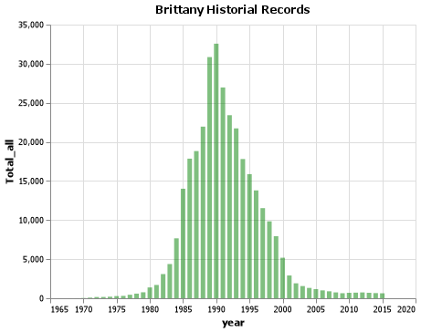

# Introduction
Author: Daniel Martinez

## Elevator Pitch
Install Visual Studio Code(VS) installing programming language Python 3.8.4 and VS extensions such Python, Markdown, and Jupyper.

Setup the environment installing libraries such Pandas, NumPy, Altair, Altair_saver.

Run Python code in VS for visualization the data in chart and download the data frame, to do a data exploration of the data frame with ```mpg.head()```. 

## Grand Question 1
How does your name at your birth year compare to its use historically?
In 1984 the name of Daniel was used for a total of 23345 times, Daniel is a biblique name that was used in 1910 for 658 times, during the 1940' and 1950' increase considerably the user of the name Daniel example of that is 1956 with a total of use of 25,242 times, between the 1960 to 1980 the use of the name Daniel decrease lest of 20,000, between 1980 to 1997 the name of Daniel increase up 20,000, since 1997 the use of the name Daniel decrease bellow 20,000 times until year 2020.
 
See visualization for more details:


## Grand Question 2
If you talked to someone named Brittany on the phone, what is your guess of their age? What ages would you not guess?
In base of the data the highest frecuency of use the name Brittany is 1990 with 32,562 time used, for that reason I guess the range of age of Brittany is between 24 to 36 years old, I guess she have 30 years old.
I did not guess any age higher of 37 years old  or lower of 20 years old due to in relation of the data between 1984 to 2000 this name was use frecuently during this pediod of 16 years, and declining  of use in 2000 to lower of 5,000 times of use.



## Grand Question 3
Mary, Martha, Peter, and Paul are all Christian names. From 1920 - 2000, compare the name usage of each of the four names.

## Grand Question 4
Think of a unique name from a famous movie. Plot that name and see how increases line up with the movie release.


Finish the readings and come to class prepared with any questions to get your environment working smoothly.

My environment is working smoothly, I have some errors one of them is to print a table with the attribute to_markdown() gave me ImportError to missing package tabulate I run  ```pip install tabulate```  and restarting VS and the table printed correctly.

Note: Altair_saver is not compatible with Python 3.9

### Grand Question 2
Create a python script and use VS Code to create the example Altair chart in the assigned readings (note that you have to type chart to see the Altair chart after you run the code). Save your Altair chart for submission.
```python
chart_color = (alt.Chart(mpg)#mpg dataframe called. 
  .encode(#encoder attribute
    x='displ', #variable for x value 
    y='hwy', # variable for y value 
    color ="class"
    )
  .mark_circle()#mark_circle attribute to create circle chart.
)
chart_color
# %% 
chart_color.save("screenshot/altair_color.png")
#call the variable to print the chart.
```


## Appendix Python Code
```python
# %% 
import sys
import pandas as pd
import numpy as np 
import altair as alt
# %%
alt.data_transformers.enable('json')
# %%
url = "https://raw.githubusercontent.com/byuidatascience/data4names/master/data-raw/names_year/names_year.csv"
data = pd.read_csv(url)
# %%
data.head(5).T
# %%
pd.unique(data.name).size
#len(pd.unique(data.name))
# %%
data.shape
# %%
data.query('name =="Daniel"').year.size
# %%
#data.query('name =="John"').year.size
#to request search for a name 
# %%
my_name= data.query('year' and 'name=="Daniel"')
my_name
# %%
# Grand question #1
# %% 
my_dataName = (my_name.groupby(['name', 'year'])
            .agg(Total_all = ('Total', np.sum),
                Average_all = ("Total", np.mean))
            .reset_index()
            .query("Total_all > 0")
            .sort_values('Total_all'))

print(my_dataName.head(1).name)
my_dataName.tail(1).name
# %% 
my_dataName
# %%
chart_name = (alt.Chart(my_dataName).mark_bar(
    color='red',
    opacity=0.5)
    .encode(
        x= alt.X("year", sort='-y'), 
        y="Total_all")
    ).properties(
        title="Daniel Historial Records"
    )
chart_name.configure_title(
    fontSize=20,
    font="Conrier",
    color='blue',
    anchor='start'
)
chart_name
# %%
chart_loess = (alt.Chart(my_dataName)
  .encode(
    x = "year",
    y = "Total_all")
  .transform_loess("year", "Total_all")
  .mark_line()
)
# %%
chart = chart_name + chart_loess
chart
# %%
chart.save("screenshot/record_name.png")

#data_name.info()
# %%
#(alt.Chart(data_name.head(25))
#    .encode(
#        x = alt.X('year==1984', sort='-y'), 
#        y = 'name=="Daniel"')
#    .mark_line())
#which name is give the most in the list 
#agrupar un nuevo dataframe y agruparlos ------
#agg 
# %%
dataName = (data.groupby(['name'])
            .agg(Total_all = ('Total', np.sum),
                Average_all = ("Total", np.mean))
            .reset_index())
dataName

dataName.sort_values('Total_all').head(1).name
dataName.sort_values('Total_all').tail(1).name
#create a new dataframe only of name and total
# %% 
#data.sort_values('name=="Daniel"')
# %%
dataName_state = (data.groupby(['name'])
            .agg(Total_all = ('TX', np.sum),
                Average_all = ("TX", np.mean))
            .reset_index()
            .query("Total_all > 0")
            .sort_values('Total_all'))

print(dataName_state.head(1).name)
dataName_state.tail(1).name
# %%
dataName
# %%


# %%
(alt.Chart(dataName_state.head(25))
    .encode(
        x = alt.X('name', sort='-y'), 
        y = "Total_all")
    .mark_bar())
# %%

(alt.Chart(dataName.head(25))
    .encode(
        x = alt.X('name', sort='-y'), 
        y = "Total_all")
    .mark_bar())
# %%
(alt.Chart(dataName.head(25))
    .encode(
        x = alt.X('name', sort='-y'), 
        y = "Total_all")
    .mark_line())

# %%
guess_name= data.query('year' and 'name=="Brittany"')
guess_name
# %%
guessName = (guess_name.groupby(['name', 'year'])
            .agg(Total_all = ('Total', np.sum),
                Average_all = ("Total", np.mean))
            .reset_index()
            .query("Total_all > 0")
            .sort_values('Total_all'))


print(guessName.head(1).name)
guessName.tail(1).name
# %%
chart_guess = (alt.Chart(guessName).mark_bar(
    color='green',
    opacity=0.5)
    .encode(
        x= alt.X("year", sort='-y'), 
        y="Total_all")
    ).properties(
        title="Brittany Historial Records"
    )
chart_guess.configure_title(
    fontSize=20,
    font="Conrier",
    color='blue',
    anchor='start'
)
chart_guess
# %%
chart_guess.save('screenshot/guess.png')
# %%
#Grand Question 3
```
